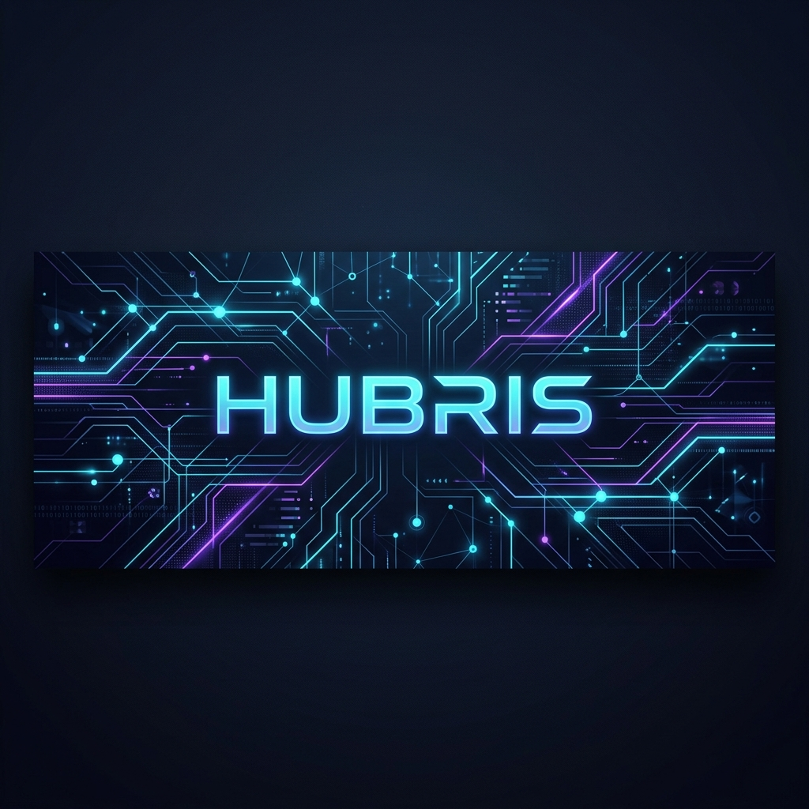

  

# Hey, I'm Phillippe (Hubris) 👋

**Systems Engineer & Architect specializing in offline-resilient SaaS engines, air-gapped threat intelligence platforms, and automated workflow orchestrations.**

I design and build software that replaces manual friction with high-performance, automated business systems. My work focuses on database concurrency, multi-tenant security, and robust offline-first synchronization.

> [!NOTE]
> ### ⚡ Available for Freelance & Collaboration
> I am currently open to select freelance projects, architectural consulting, and contract engagements.  
> **Have a complex workflow that needs automating, a database bottleneck to solve, or a SaaS platform to build?**  
> 📧 [Reach out to discuss your project:](mailto:alphllppegarado@gmail.com)

---

## 🚀 Featured Engineering

<table border="0">
  <tr>
    <td width="33.3%" valign="top">
      <h4>🛡️ <a href="https://github.com/Hubrisdog/aegis-threat-intel">aegis-threat-intel</a></h4>
      
Self-hosted, privacy-first threat intelligence platform (TIP) for local IOC correlation and AI analysis.

      
      
    </td>
    <td width="33.3%" valign="top">
      <h4>📦 <a href="https://github.com/Hubrisdog/logiflow-hub">logiflow-hub</a></h4>
      
Premium enterprise-grade inventory intelligence and logistics orchestration platform built with React, TypeScript, and Supabase.

      
      
    </td>
    <td width="33.3%" valign="top">
      <h4>📅 <a href="https://github.com/Hubrisdog/nexa">nexa</a></h4>
      
Multi-tenant scheduling and CRM platform with round-robin lead allocation and OAuth sync.

      
      
    </td>
  </tr>
</table>

---

## 🛠️ Tech Stack & Arsenal

| Category | Tools & Technologies |
| :--- | :--- |
| **Languages** |      |
| **Frontend** |        |
| **Backend & DB** |       |
| **Security & DevOps** |    |

---

  <i>“Building tomorrow's secure systems, one repository at a time.”</i>

